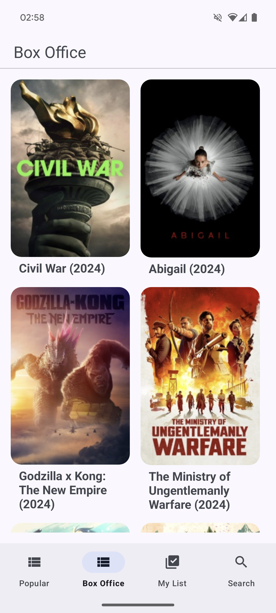
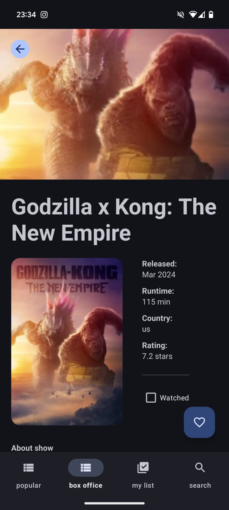
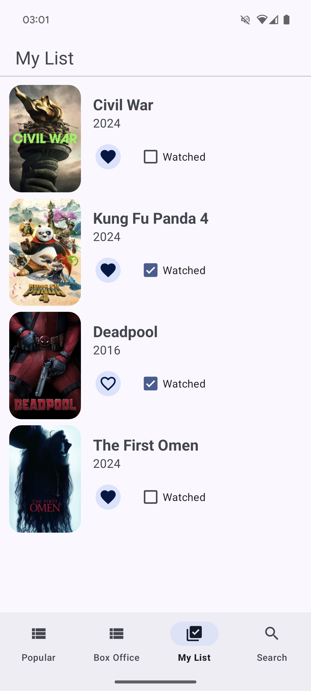
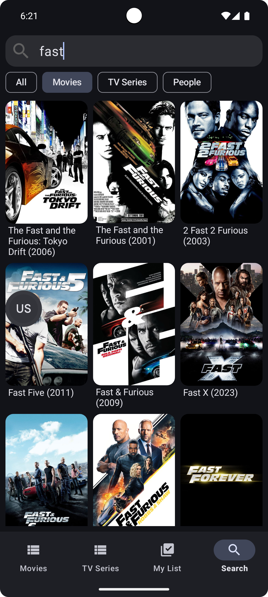

# MuviTracker

Movie tracking android application based on [Trakt API](https://trakt.docs.apiary.io/#).

The app is written using kotlin coroutines and Dagger for DI, includes data caching for better performance 
and follows the principles of Clean Architecture.

Soon on the Play Store as a complete application for tracking favorite movies and series

## Features
- Explore popular and box-office movies
- Search any movie from Trakt database
- My list: add a movie to favourites to see it later, and mark it as viewed when done

## Screenshots

  
  
  
  

## Tech stack & open-source libraries
- Min SDK level 24
- MVVM Architecture
- Entirely written in [Kotlin](https://kotlinlang.org/) 
- [kotlinx.coroutines](https://github.com/Kotlin/kotlinx.coroutines)
- [kotlinx.serialization](https://github.com/Kotlin/kotlinx.serialization)
- [Dagger](https://github.com/google/dagger/)
- [Retrofit](https://github.com/square/retrofit) - Construct the REST APIs
- [Gson](https://github.com/google/gson)
- [Store4](https://github.com/MobileNativeFoundation/Store) - Caching manager for coroutines
- [Glide](https://github.com/bumptech/glide) - Loading images
- [FragmentViewBindingDelegate-kt](https://github.com/Zhuinden/fragmentviewbindingdelegate-kt)
- [Material Design 3](https://m3.material.io/)
- [Androidx:](https://github.com/androidx/androidx/tree/androidx-main)
  - [Appcompat](https://github.com/androidx/androidx/tree/androidx-main/appcompat)
  - [SwipeRefreshLayout](https://github.com/androidx-releases/Swiperefreshlayout?tab=readme-ov-file) 
  - [Core](https://github.com/androidx/androidx/tree/androidx-main/core)
  - [Paging3](https://github.com/androidx/androidx/tree/androidx-main/paging)
  - [Room](https://github.com/androidx/androidx/tree/androidx-main/room) - SQLite database for storage and caching

  
## What's next?
- Features
    - movies - more categories
    - TV Series support
    - actor cards support
    - filter and sort on MyList category
- Animations and other graphic features

## APK Download
Go to the <u>[Releases](https://github.com/ologdm/muvi-tracker/releases)</u> to download the latest APK.

