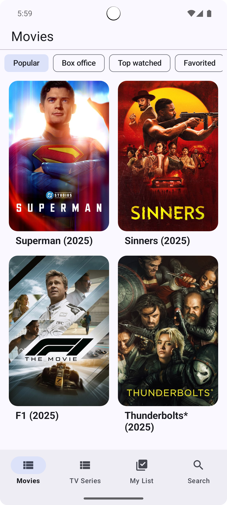
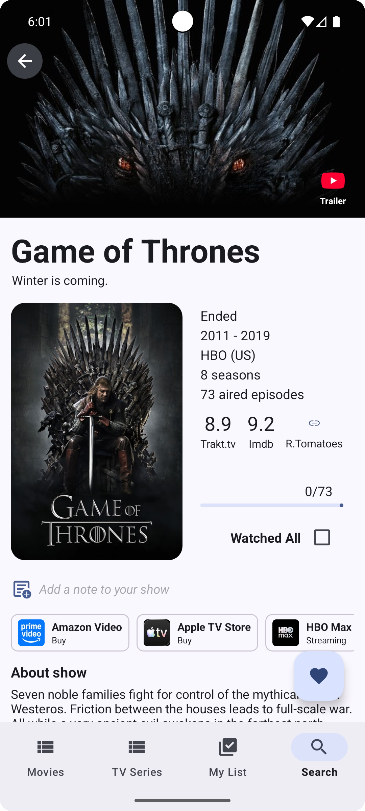
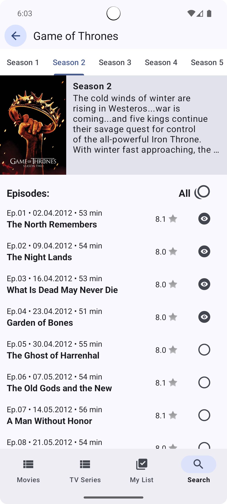
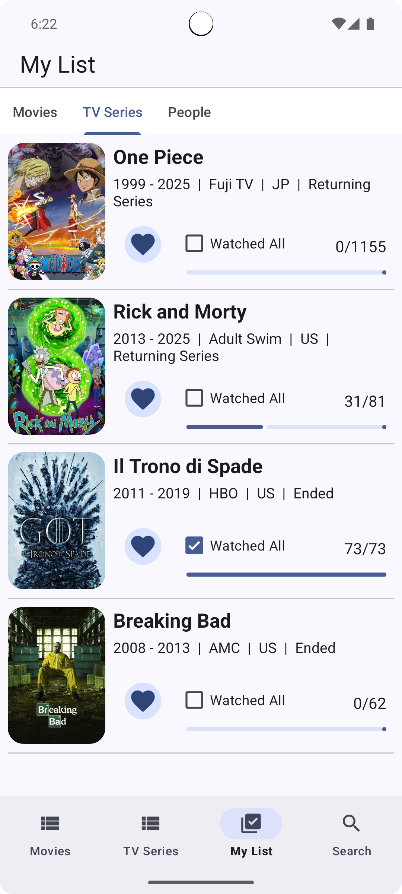
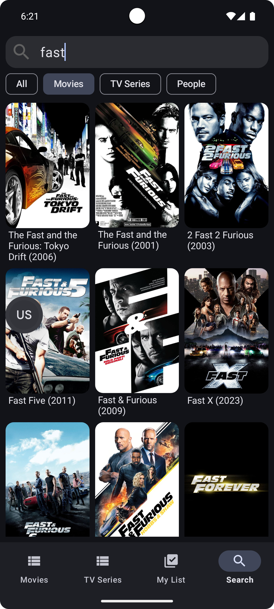

# 🎬 MuviTracker 

[](https://kotlinlang.org/)


[](https://play.google.com/store/apps/details?id=dev.dimao.muvitracker)

**MuviTracker** helps you discover, track, and manage your favorite movies, TV series, and actors — all in one place.

> Built with a multi-source API architecture and an offline-first design, it delivers a fast and seamless experience 
anywhere, even without an internet connection.


## ✨ Features
- **Global Search:** Search across millions of movies, TV series, and actors using the Trakt database
- **Dynamic Exploration:** Browse curated lists such as Popular, Watched, Favorited, Coming Soon, and Box Office
- **Personal Tracking:** Save favorite movies, TV shows, and actors while tracking watched movies, TV show seasons, and episodes
- **Detailed Content:** Explore rich details for movies, TV series, seasons, episodes, and actors — including trailers, streaming availability, ratings and personal notes
- **Multilingual & Multi-region support:** The app supports multiple languages and region-based streaming providers worldwide
- **Offline First:** Cached and locally stored data ensures smooth usage even without connectivity

##  📸 Screenshots

<div class="row">
  
  
  
  
  
</div>

## 🏗 Architecture & Design

The project follows a modularized Clean Architecture approach to ensure scalability, 
maintainability, and separation of concerns.

### Modules
- **App:** Application entry point and dependency injection setup
- **Presentation:** UI layer (MVVM), ViewModels, ViewBinding and UI logic
- **Domain:** Core business logic, domain models, repository interfaces, and shared domain types
- **Data:** Repository implementations, remote APIs, local database (Room), and caching layer
- **Core:** Shared utilities, common classes, and base components used across modules

Custom backend logic is implemented to manage:
- Favorites
- Watched movies and episodes
- Local state synchronization


## 🧠 Key Engineering Highlights

- Multi-source data integration (Trakt, TMDB, OMDb)
- Offline-first architecture with local caching and persistence
- Reactive data handling using Kotlin Flow
- Efficient large dataset handling with Paging 3
- Clean modular architecture following separation of concerns


## 🛠 Tech Stack & Open-Source Libraries

### Core
- Build entirely in [Kotlin](https://kotlinlang.org/)
- [Kotlin Coroutines & Flow](https://github.com/Kotlin/kotlinx.coroutines) - for asynchronous and reactive programming
- [Dagger Hilt](https://github.com/google/dagger/) - for dependency injection
- **KSP** (Kotlin Symbol Processing) - for annotation processing

### Networking & Data
- [Retrofit](https://github.com/square/retrofit) - for REST API communication
- [Room Database](https://github.com/androidx/androidx/tree/androidx-main/room) for local storage and persistence (SQLite-based)
- [Store5](https://github.com/MobileNativeFoundation/Store) for reactive caching and offline-first data management
- [Kotlinx Serialization](https://github.com/Kotlin/kotlinx.serialization) and Gson for JSON parsing

### UI & UX
- [Material Design 3](https://m3.material.io/) for modern UI design
- [Paging3](https://github.com/androidx/androidx/tree/androidx-main/paging) for efficient pagination of large datasets
- [Glide](https://github.com/bumptech/glide) for image loading and caching
- [SwipeRefreshLayout](https://github.com/androidx-releases/Swiperefreshlayout?tab=readme-ov-file) for manual refresh interactions
- [FragmentViewBindingDelegate-kt](https://github.com/Zhuinden/fragmentviewbindingdelegate-kt) for safer and cleaner ViewBinding in Fragments


## ⚙️ Setup

create your api keys and add them to `local.properties`
```
trakt_api_key = your_trakt_api_key
tmdb_api_key = your_tmdb_api_key
omdb_api_key = your_omdb_api_key
```

## Download
[](https://play.google.com/store/apps/details?id=dev.dimao.muvitracker)
