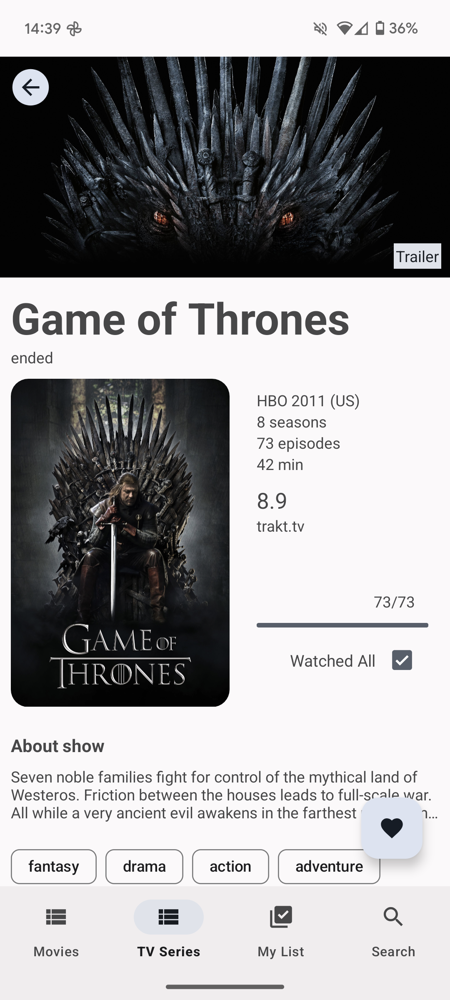
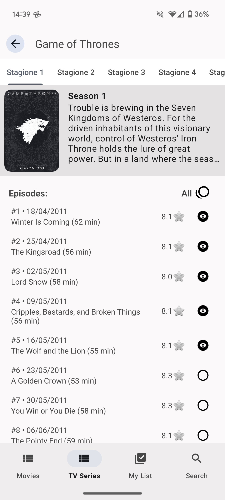
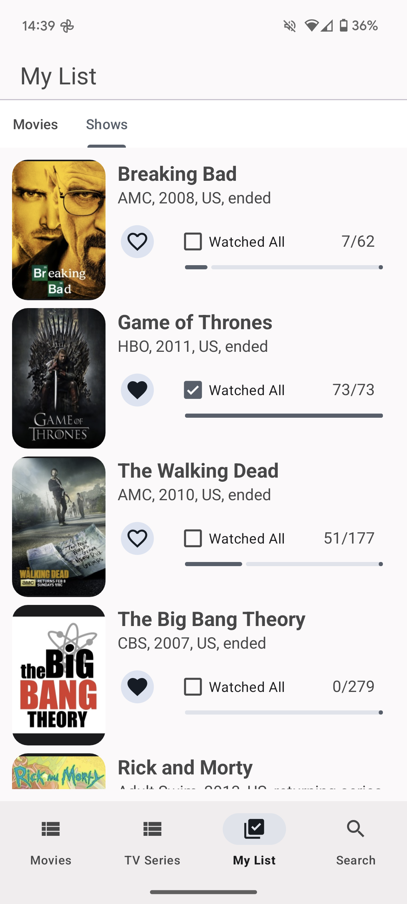
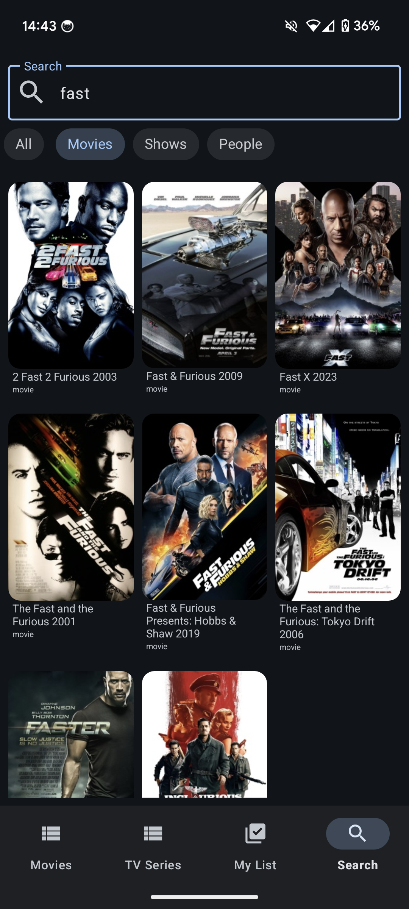

# MuviTracker

Movie tracking android application based on [Trakt API](https://trakt.docs.apiary.io/#), 
but also on [Tmdb](https://developer.themoviedb.org/docs/getting-started) and [Omdb](https://www.omdbapi.com/).

The app is entirely written in Kotlin and extensively uses Coroutines and Reactive Programming for managing asynchronous flows, 
use Dagger Hilt for DI, includes data caching for better performance, and follows the principles of Clean Architecture.

Custom backend logic is implemented for saving favorites and watched content locally.

## Features

- Search for any movie, TV series, or actor on Trakt Database
- Explore suggested lists (such as popular, watched, coming soon, boxoffice etc.)
- Save favorite movies and TV series to a personal list and monitor watched movies and episodes.
- View details of movies, TV series, seasons, episodes, and actors.

## Screenshots

<div class="row">
  
  
  
  
  
</div>

## Setup

create your api keys and add them to `local.properties`
```
trakt_api_key = your_trakt_api_key
tmdb_api_key = your_tmdb_api_key
```


## Tech stack & open-source libraries

- Min SDK level 24
- MVVM Architecture
- Entirely written in [Kotlin](https://kotlinlang.org/)
- [kotlinx.coroutines](https://github.com/Kotlin/kotlinx.coroutines)
- [kotlinx.serialization](https://github.com/Kotlin/kotlinx.serialization)
- [Dagger](https://github.com/google/dagger/) - for Dependency Injection
- [Retrofit](https://github.com/square/retrofit) - Construct the REST APIs
- [Gson](https://github.com/google/gson)
- [Store4](https://github.com/MobileNativeFoundation/Store) - Caching manager for coroutines
- [Glide](https://github.com/bumptech/glide) - Loading images
- [FragmentViewBindingDelegate-kt](https://github.com/Zhuinden/fragmentviewbindingdelegate-kt) 
- [Material Design 3](https://m3.material.io/)
- [Androidx:](https://github.com/androidx/androidx/tree/androidx-main)
    - [Appcompat](https://github.com/androidx/androidx/tree/androidx-main/appcompat)
    - [SwipeRefreshLayout](https://github.com/androidx-releases/Swiperefreshlayout?tab=readme-ov-file)
    - [Core](https://github.com/androidx/androidx/tree/androidx-main/core)
    - [Paging3](https://github.com/androidx/androidx/tree/androidx-main/paging)
    - [Room](https://github.com/androidx/androidx/tree/androidx-main/room) - SQLite database for
      storage and caching

## Download
[](https://play.google.com/store/apps/details?id=dev.dimao.muvitracker)
